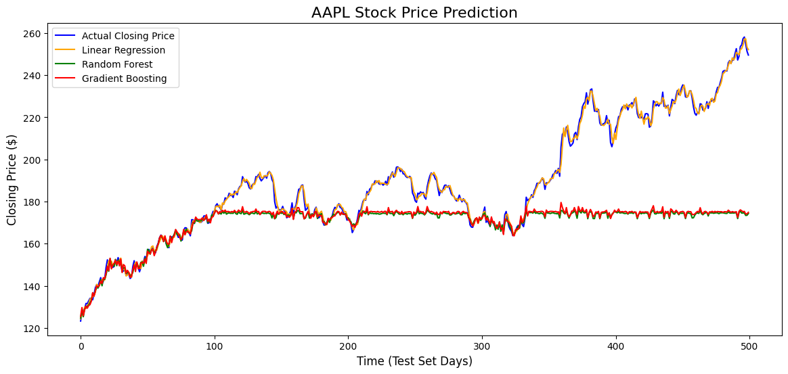

# Stock Price Prediction Using Machine Learning

## Project Overview
This project predicts the next-day closing price of a stock (AAPL) using historical stock data and feature engineering. The goal is to leverage past price trends, volatility, and momentum indicators to forecast future stock prices using supervised machine learning models.

---

## Dataset
- Historical stock data is fetched directly from **Yahoo Finance** using the `yfinance` Python library.  
- Time range: **2010-01-01 to 2025-01-01**.  
- Features include previous day prices, moving averages, daily returns, and volatility.

---

## Features
| Feature | Description |
|---------|-------------|
| Prev_Open, Prev_High, Prev_Low, Prev_Volume | Previous day’s prices and trading volume |
| MA_5, MA_10 | 5-day and 10-day moving averages |
| Daily_Return | Daily percentage change of closing price |
| High_Low_Diff | Daily volatility (High - Low) |

---

## Models Used
1. **Linear Regression** – Captures linear relationships.  
2. **Random Forest Regressor** – Captures non-linear patterns with ensemble decision trees.  
3. **Gradient Boosting Regressor** – Sequential ensemble model that improves accuracy.

---

## Evaluation Metrics
- **RMSE (Root Mean Squared Error)** – Measures average prediction error.  
- **R² Score** – Measures how much variance in the closing price the model explains.

---

## Visualization
- **Actual vs Predicted Closing Prices**  

